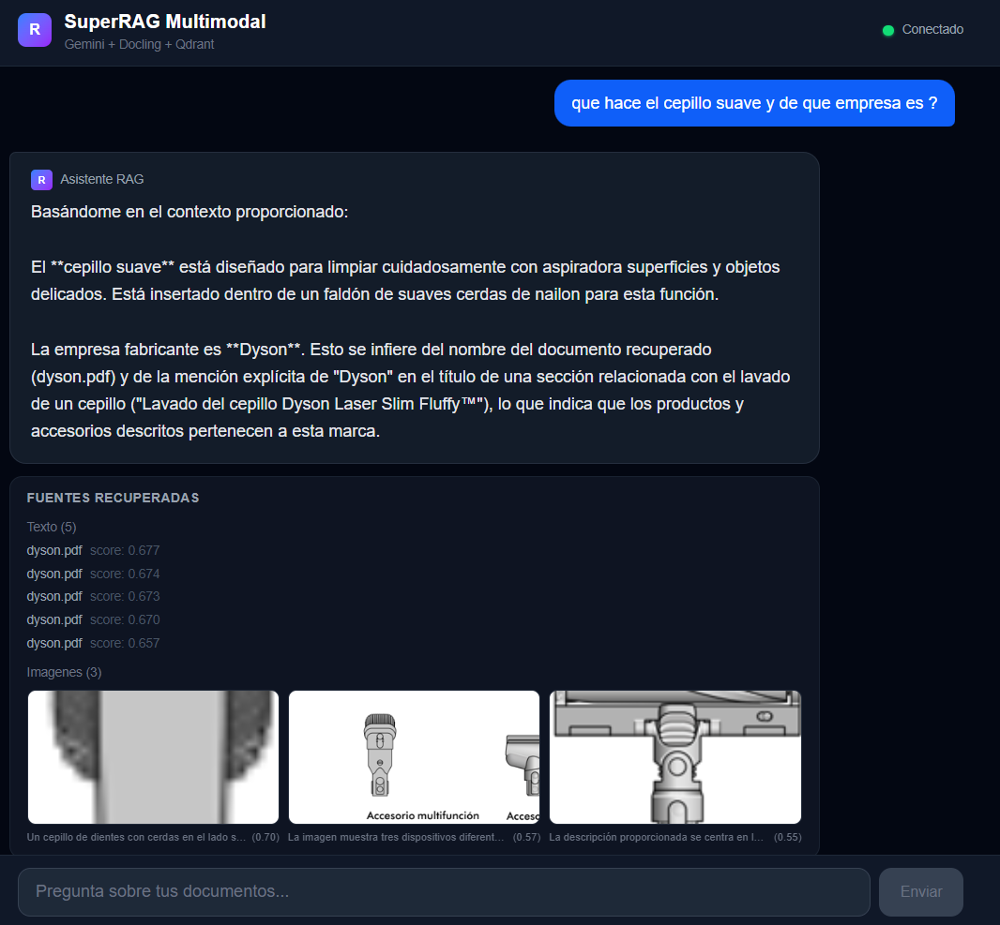
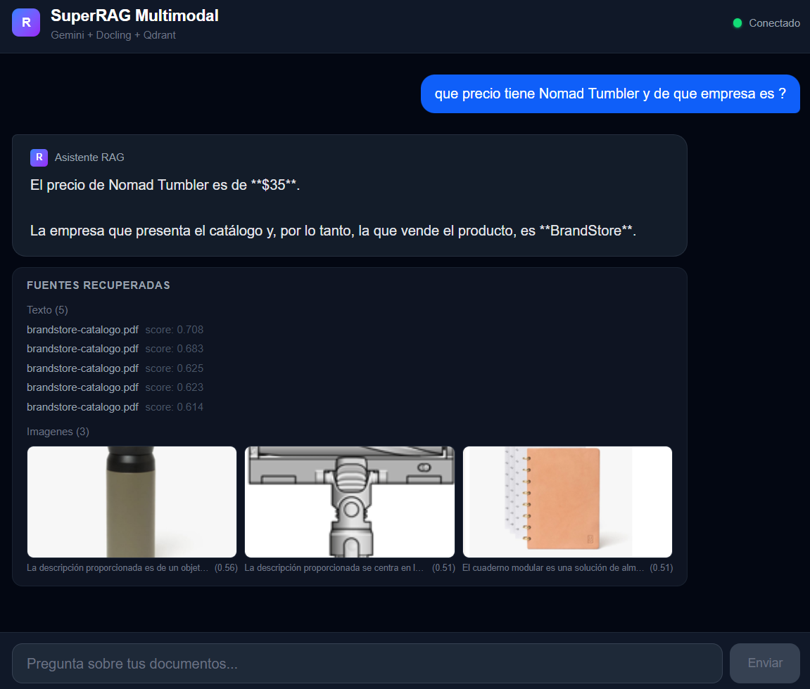
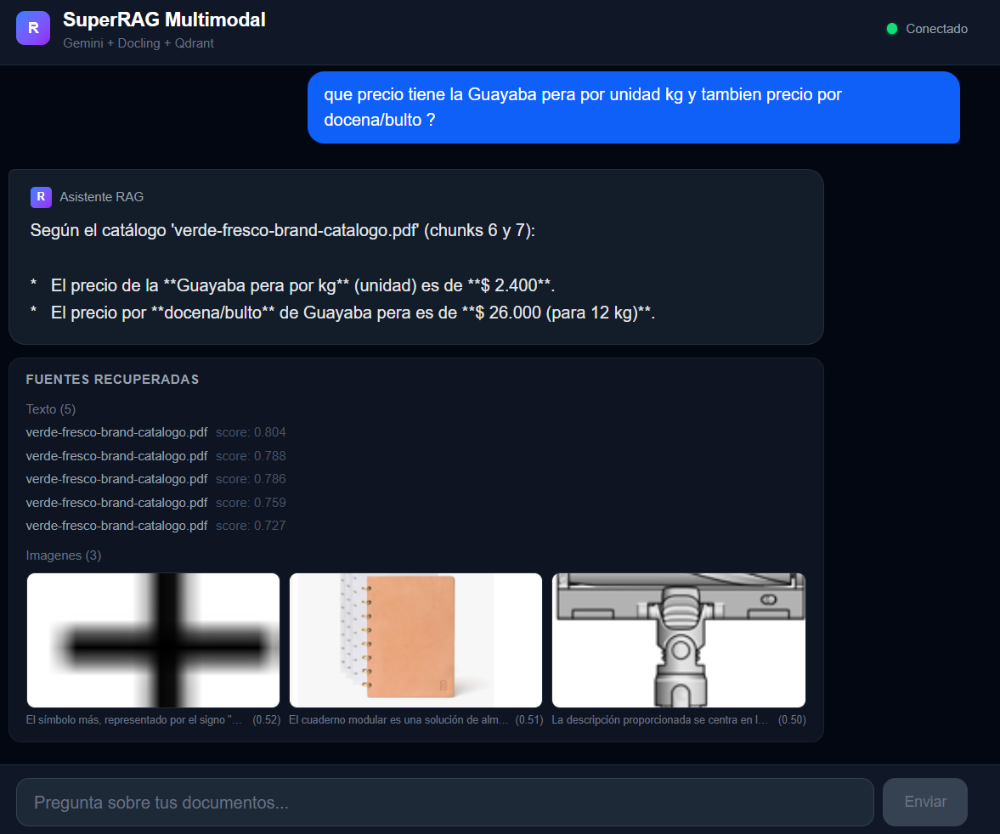
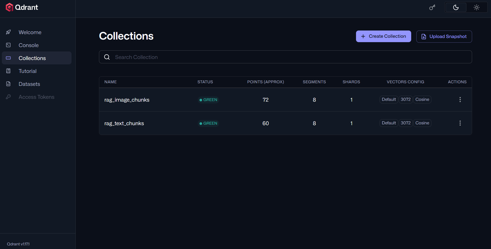

# SUPER RAG Multimodal FastAPI Docling LangChain Qdrant


SUPER RAG Multimodal system with support for PDFs, images, and text documents built with FastAPI, Docling, LangChain, and Qdrant.


<p align="center">
  
</p>

<p align="center">
  
</p>

<p align="center">
  
</p>

### 3. Frontend (Next.js) in repository [FRONTEND URL](https://github.com/diegoperea20/Next.js-SUPER-Multimodal-RAG-Chat-frontend)

```powershell

# Install dependencies
npm install

# Run in development
npm run dev
```


## 📐 General Architecture

```
┌─────────────────────────────────────────────────────────┐
│             Input PDFs (one or more folders)            │
└──────────────────────────┬──────────────────────────────┘
                           │
                    ┌──────▼───────┐
                    │  DOCLING     │  → Markdown + images in Base64
                    │  (with OCR)  │  + contextual text
                    └──────┬───────┘
                           │
              ┌────────────┴─────────────┐
              │                          │
       ┌──────▼───────┐          ┌───────▼────────┐
       │  Texto limpio│          │   Images       │
       │  (Markdown)  │          │  (Base64 + context)│
       └──────┬───────┘          └───────┬────────┘
              │                          │
       ┌──────▼───────┐          ┌───────▼────────┐
       │   Chunking   │          │ NVIDIA Vision  │
       │ (overlapping)│          │  Captioning    │
       └──────┬───────┘          │ (context-aware)│
              │                  └───────┬────────┘
       ┌──────▼────────────────────────▼─┐
       │   gemini-embedding-2-preview     │
       │   (text) + (text caption)        │
       └──────────────┬───────────────────┘
                      │
               ┌──────▼───────┐
               │    Qdrant    │  type="text" | type="image"
               │  (Docker)    │
               └──────┬───────┘
                      │
               ┌──────▼───────┐
               │Dual Retrieval│  k_text + k_images
               └──────┬───────┘
                      │
               ┌──────▼────────┐
               │ Gemini 2.5    │  → Response multimodal
               │   Flash       │
               └───────────────┘
                      ↑
               ┌──────┴────────┐
               │  FastAPI WS   │  WebSocket /ws/chat
               └───────────────┘
```

---


# Installation

##  Qdrant Setup

Official documentation for [Qdrant](https://qdrant.tech/documentation/quickstart/)

Download Qdrant in Docker:
```powershell
docker pull qdrant/qdrant
```

💾 (Optional) Persist data

To avoid losing data when shutting down the container:

```powershell
docker run -d --name qdrant_container -p 6333:6333 -p 6334:6334 -v ${PWD}/qdrant_storage:/qdrant/storage qdrant/qdrant
```

🔍 4. Verify that it is running
```powershell
docker ps
```


You should see qdrant_container active.

Test Qdrant from the browser
Open:

localhost:6333/dashboard

<p align="center">
  
</p>


### Prerequisites

- Python 3.11 or higher
- [uv](https://docs.astral.sh/uv/) - Ultra-fast Python package manager


## Installation

### Prerequisites

- Python 3.11 or higher


**Create .env file** with the following content:
GOOGLE API KEY in Google AI Studio: https://aistudio.google.com/prompts/new_chat

NVIDIA API KEY in NVIDIA AI Endpoints: https://build.nvidia.com/nvidia/nemotron-nano-12b-v2-vl

```env
# Google Gemini
GOOGLE_API_KEY=tu_api_key_aqui

# NVIDIA AI Endpoints
NVIDIA_API_KEY=tu_nvidia_api_key_aqui
NVIDIA_MODEL=nvidia/nemotron-nano-12b-v2-vl

# Qdrant
QDRANT_HOST=localhost
QDRANT_PORT=6333
QDRANT_COLLECTION_TEXT=rag_text_chunks
QDRANT_COLLECTION_IMAGES=rag_image_chunks

# Embedding
EMBEDDING_MODEL=gemini-embedding-2-preview
EMBEDDING_DIMENSION=3072

# Generación
GENERATION_MODEL=gemini-2.5-flash

# Carpeta de documentos
DOCS_FOLDER=./filesRAG

# Chunking
CHUNK_SIZE=800
CHUNK_OVERLAP=150

# Retrieval
K_TEXT=5
K_IMAGES=3
```

### Quick Start with UV

```bash
# Clone the repository
git clone <repository-url>
cd <repository-url>

# Install base dependencies
uv sync

# Run server
uv run python main.py
```


### Installation steps

1. **Clone or navigate to the project**:

2. **Install dependencies with uv**:

```bash
# Create virtual environment and install dependencies
uv sync
```

> **Note**: The project uses `uv` for fast dependency management. If you prefer pip, you can generate requirements.txt first:

```bash
uv pip compile pyproject.toml -o requirements.txt
pip install -r requirements.txt
```


### Installation steps

1. **Clone or navigate to the project**:


2. **Install dependencies with uv**:

```bash
# Create virtual environment and install dependencies
uv sync
```

Create the project with uv without initializing git use --bare

```python
uv init --python 3.11 --bare
```

But create the file .python-version

Option A: Using requirements.txt

```python
# Generate requirements.txt from pyproject.toml
uv pip compile pyproject.toml -o requirements.txt

#if use pip :
pip install -r requirements.txt 

# Install dependencies from requirements.txt

uv add -r requirements.txt
```

Option B: Direct sync

```python
uv sync
```

## Inspiration
video link [youtube video](https://www.youtube.com/watch?v=kjLOeinAuhM)
repo file [repo file](https://github.com/alarcon7a/youtube-tutorial-sources/blob/main/Notebooks/Google%20AI/Embeddings/Mistral_gemini_embeddings/notebooks/Tutorial_Mistral_Gemini_RAG.ipynb)

## 🎯 Usage

### Start the application

```bash
# Activate virtual environment
.venv\Scripts\activate  # Windows
source .venv/bin/activate  # macOS/Linux
```

or / and

```bash
# Run application for not open browser immediately
uv run python main.py
```


### 📄 License

This project is licensed under the MIT License - see the [LICENSE](LICENSE) file for details.

---

## 👨‍💻 Author / Autor

**Diego Ivan Perea Montealegre**

- GitHub: [@diegoperea20](https://github.com/diegoperea20)

---

Created by [Diego Ivan Perea Montealegre](https://github.com/diegoperea20)